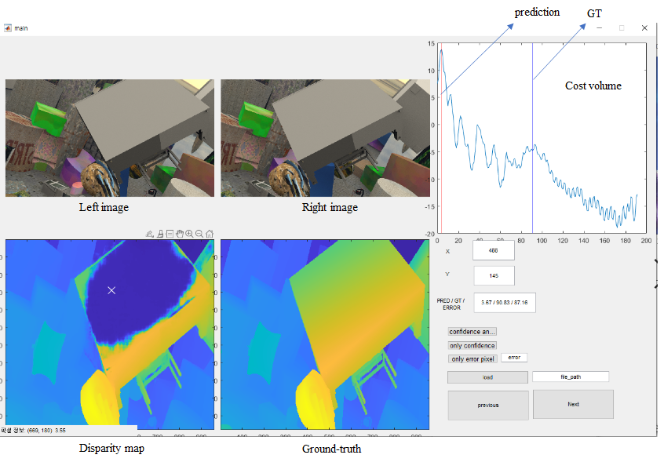
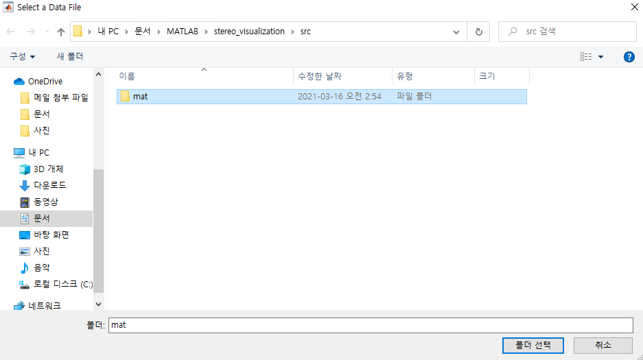
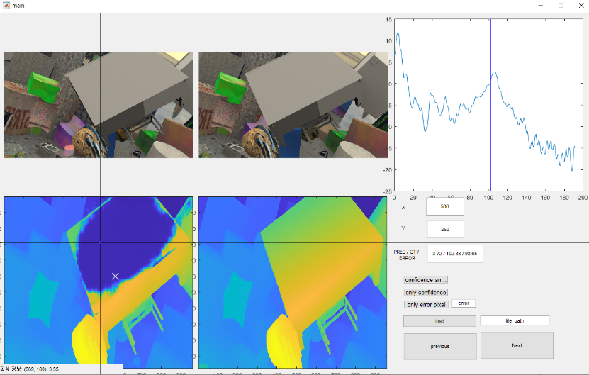
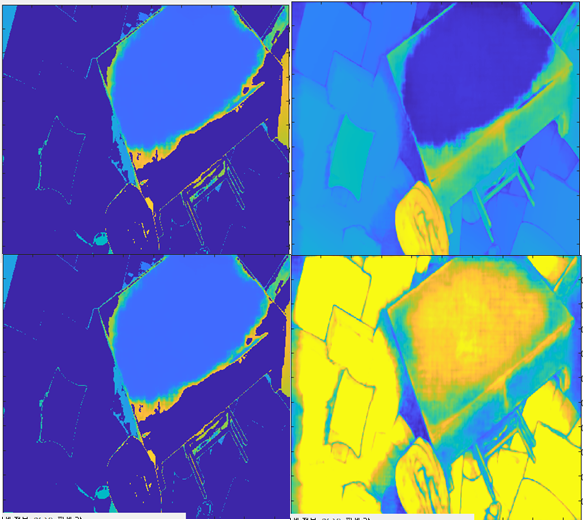

# Stereo matching cost volume visualization

MATLAB gui project: it visualizes the distribtuion of the cost volume of stereo matching.

>  Simply run main.m using MATLAB.

This project was designed to discover the problems of AcfNet. it visualize the binomial distribution problem in AcfNet.

> Zhang, Youmin, et al. "Adaptive unimodal cost volume filtering for deep stereo matching." *Proceedings of the AAAI Conference on Artificial Intelligence*. Vol. 34. No. 07. 2020.

# How to use?

1. select mat folder. you need a mat file of the specified format. You can download the example mat file from the following link: https://drive.google.com/file/d/1_Rq4vrCaqcL5DeH2ttKJo2tiUzomtMmi/view?usp=sharing

2. Choose the pixel you want. Then, the distribution of the cost volume in the area is visualized.

it supports various visualization such as error, confidence map, etc.
Note that the reliability of AcfNet is high in areas with large errors. through this project, i discovered a problem with AcfNet.